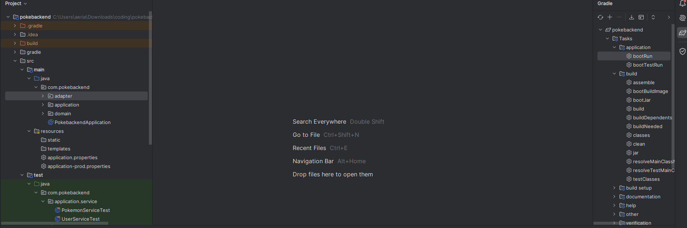

# PokeBackend

This backend API was created using Spring boot initializer. It uses Java 17 And gradle 8.7

It has unit tests and uses the Hexagonal Architecture (also called ports and adapters)

**Git repository:** https://github.com/saureth/pokebackend/

**Prerequisites:**

- An IDE (intellij, eclipse, etc).

- Gradle 8.7 (distributionUrl=https\://services.gradle.org/distributions/gradle-8.7-bin.zip).

- Java 17 (in the gradle wrapper you can set the JVM easily).

- GIT (so you can clone the repo).

- MySQL (optional, so you can check the db, even tho its in the cloud).

- MySQL Workbench 8.0 (optional, so you can check the db, even tho its in the cloud).

**How to run the code:**

- Clone the repository https://github.com/saureth/pokebackend/:

- Open it on your IDE:

- Configure JVM and gradle. As you can see i use gradle 8.7 and in the wrapper and JVM for java 17 (Amazon Corretto 17.0.11) - you can use any just make sure its Java 17.

- Use the clean task from gradle

- Use the build task from gradle

- Use the boot-run task from gradle

**The app is now running locally. It uses a AWS RDS database (mysql)**

I share my credentias in application-prod.properties if you want to connect to it. When the interview proccess is over i am going to stop the service in AWS because i don't want to be charged. Please don't make a lot of calls to the db so i don't get charged.

Use the app

I added a text file with curl requests and a postman collection with the same requests. Those are CRUD requests, the db starts with 20 public pokemons (common, repeated) for each of the 10 users, and 1 private pokemon for each user.
The text file is located at: pokebackend\src\main\resources\Consumers\Curl-consumers.txt

Optional:

You can locally set up the database. First open mysql (i use mysql workbench):

Run the pokedb.sql , open it with any text editor, and copy paste in mysql (in my case workbench).

Example:

**finally, you will have to move the application.properties so it connects locally:**

spring.datasource.url=jdbc:mysql://mysql-container:3306/pokedb

# Finally, i wanted to say this:

I tried to deploy the backend also in AWS, but it was not possible to me. Sadly, i had to do this in my free time while i was working so i had little time and i focused on finishing everything else. When i deploy it to AWS i get errors from hibernate, appearently i have errors related to configuration but i didn't have more time so i stopped it. I share with you my attempts:

- I used a dockerfile (you can see the file here in the repo) with linux and AWS CLI installed. I used ECR to push the docker container into AWS and here we have it:
  
- I used the AWS CLI in order to upload:

* docker build -t debian-aws .
* docker run -it --privileged --name debian-aws-container debian-aws

- And after installing and creating tasks definition for ECS, the pod starts, but stops if i execute something :c
  

I couldn't make it work

May 28, 2024 at 02:27 (UTC-5:00) Caused by: jakarta.persistence.PersistenceException: [PersistenceUnit: default] Unable to build Hibernate SessionFactory; nested exception is org.hibernate.exception.JDBCConnectionException: Unable to open JDBC Connection for DDL execution [Communications link failure pokebackend-container
May 28, 2024 at 02:27 (UTC-5:00) The last packet sent successfully to the server was 0 milliseconds ago. The driver has not received any packets from the server.] [n/a] pokebackend-container
May 28, 2024 at 02:27 (UTC-5:00)

Then, i tried to deploy it on EC2, using putty to connect to my server and manually uploading the jar to it. the same error appeared:

java.lang.NullPointerException: Cannot invoke "org.hibernate.engine.jdbc.spi.SqlExceptionHelper.convert(java.sql.SQLException, String)" because the return value of "org.hibernate.resource.tra>
May 29 04:03:36 ip-172-31-27-179 java[1149]: at org.hibernate.resource.transaction.backend.jdbc.internal.JdbcIsolationDelegate.delegateWork(JdbcIsolationDelegate.java:116) ~[hibernate-core-6.5.2.Final.jar!/:6.5.2.Final]
May 29 04:03:36 ip-172-31-27-179 java[1149]: at org.hibernate.engine.jdbc.env.internal.JdbcEnvironmentInitiator.getJdbcEnvironmentUsingJdbcMetadata(JdbcEnvironmentInitiator.java:290) ~[hibernate-core-6.5.2.Final.jar!/:6.5.2.Fina>
May 29 04:03:36 ip-172-31-27-179 java[1149]: at org.hibernate.engine.jdbc.env.internal.JdbcEnvironmentInitiator.initiateService(JdbcEnvironmentInitiator.java:123) ~[hibernate-core-6.5.2.Final.jar!/:6.5.2.Final]
May 29 04:03:36 ip-172-31-27-179 java[1149]:

So i finally gave up. Saldy, only the RDS database is in the cloud.
