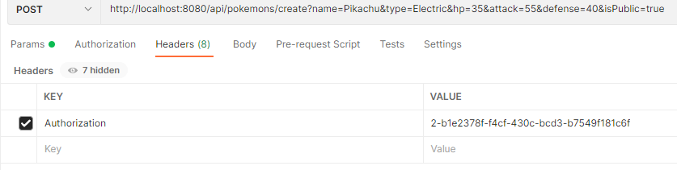

# API DOCUMENTATION

- For a better experience, there is also available a Postman Collection with the same information.
- There are some requests that uses token, you need first to be logged in. The login request returns with the token, and it expires after 20 minutes.

- With curl, you just need to replace the string of the token, but in postman, please replace the HEADER key Authorization. This is because i didn't used Bearer token, just a regular simple token in memory.
  

- Get random pokemon from pokeapi
  curl -X GET "http://localhost:8080/api/pokemons/random"
  (this is for the item: 6. Add an endpoint that requires your server to retrieve a random number from a public API and send it back to the user. (done).)
  I decided to use pokeapi and get a random pokemon from that api.

- Register new user (remember the rules for the emal and password)
  curl -X POST "http://localhost:8080/api/register" -H "Content-Type: application/json" -d "{\"email\": \"john.doe@example.com\", \"password\": \"Password123!\", \"firstName\": \"John\", \"lastName\": \"Doe\"}"

- User login (get the token and save it!)
  curl -X POST "http://localhost:8080/api/login" -d "email=john.doe@example.com" -d "password=Password123!"

- Get public pokemons (no need of token)
  curl -X GET "http://localhost:8080/api/pokemons/public?page=0&size=10"

- Create Pokemon (needs token, delete "Bearer YOUR_TOKEN" and paste your token )
  curl -X POST "http://localhost:8080/api/pokemons/create" -H "Authorization: YOUR TOKEN" -d "name=Pikachu" -d "type=Electric" -d "hp=35" -d "attack=55" -d "defense=40" -d "isPublic=true"

- Get pokemon from user (needs token, delete "YOUR_TOKEN" and paste your token )
  curl -X GET "http://localhost:8080/api/pokemons/user?page=0&size=10" -H "Authorization: YOUR TOKEN"

- Update pokemon. Here, if you use 1 it wont allow you because its private. Use a public Pokémon. Like 49. (needs token, delete "YOUR_TOKEN" and paste your token )
  curl -X PUT "http://localhost:8080/api/pokemons/update/{pokemon_id}" -H "Authorization: YOUR TOKEN" -d "name=Raichu" -d "type=Electric" -d "hp=60" -d "attack=90" -d "defense=55"

- Delete Pokémon (needs token, delete "YOUR_TOKEN" and paste your token ) Here, if you use 1 it wont allow you because its private. Use a public Pokémon. Like 49.
  curl -X DELETE "http://localhost:8080/api/pokemons/delete/{pokemon_id}" -H "Authorization: YOUR TOKEN"
